## Custom Player Models For Ocarina of Time Online
Here are custom player models completely developer approved.
## Example Model
### Bombiwa from The Legend of Zelda: Ocarina of Time
#### By [Psi-Hate](https://github.com/Psi-Hate)
[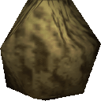](https://github.com/hylian-modding/Z64-CustomPlayerModels/raw/master/oot/pak/Bombiwa.pak)
### Dark Link from The Legend of Zelda: Ocarina of Time
#### By [CrookedPoe](https://github.com/CrookedPoe)
[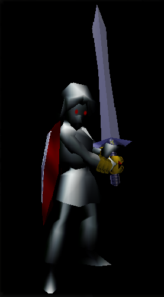](https://github.com/hylian-modding/Z64-CustomPlayerModels/raw/master/oot/pak/zzplayas_DarkLink.pak)
### Dampe from The Legend of Zelda: Ocarina of Time
#### By [Psi-Hate](https://github.com/Psi-Hate)
[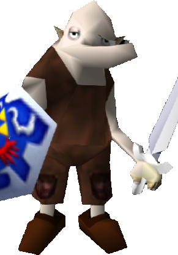](https://github.com/hylian-modding/Z64-CustomPlayerModels/raw/master/oot/pak/Dampe.pak)
### Edward Elric from Full Metal Alchemist
#### By [Unesag](https://github.com/Unesag/Z64-CustomPlayerModels)
[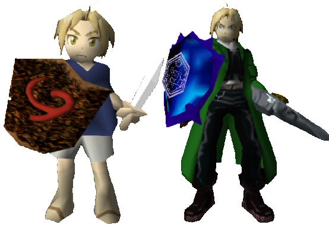](https://github.com/hylian-modding/Z64-CustomPlayerModels/raw/master/oot/pak/edElricMod.pak)
### Fierce Deity from The Legend of Zelda: Majora's Mask
#### By [CrookedPoe](https://github.com/CrookedPoe)
[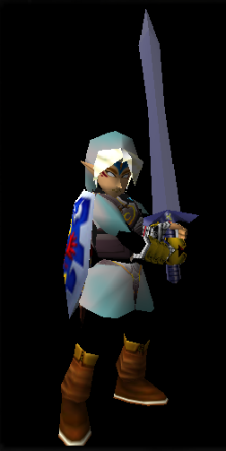](https://github.com/hylian-modding/Z64-CustomPlayerModels/raw/master/oot/pak/zzplayas_Deity.pak)
### Fierce Deity from The Legend of Zelda: Majora's Mask 3DS
#### By [CraftyBoss](https://github.com/CraftyBoss)
[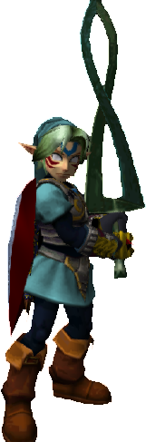](https://github.com/hylian-modding/Z64-CustomPlayerModels/raw/master/oot/pak/FierceDeity3DS.pak)
### Fierce Deity *Remastered* from The Legend of Zelda: Majora's Mask
#### By [Skilar](https://skilarmbabcock.wixsite.com/skilarmodding)
[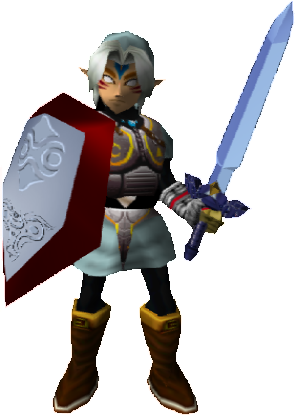](https://github.com/hylian-modding/Z64-CustomPlayerModels/raw/master/oot/pak/BetterFierceDeityLink.pak)
### Godot from Ace Attorney
#### By Anonymous

### Inuyasha from Inuyasha
#### By Hailey

#### [Tessaiga as Biggoron Sword](https://github.com/hylian-modding/Z64-CustomPlayerModels/raw/master/oot/pak/Tessaiga.pak)
### Izou Link from The Legend of Zelda
#### By [Psi-Hate](https://github.com/Psi-Hate)

### Kafei from The Legend of Zelda: Majora's Mask
#### By [CrookedPoe](https://github.com/CrookedPoe)
[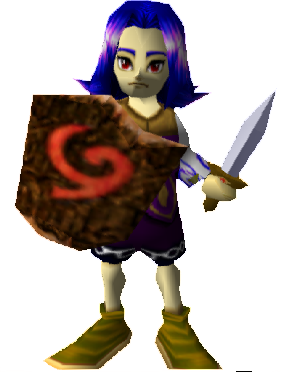](https://github.com/hylian-modding/Z64-CustomPlayerModels/raw/master/oot/pak/zzplayas_Kafei.pak)
### Linebeck from The Legend of Zelda: Phantom Hourglass
#### By [Psi-Hate](https://github.com/Psi-Hate)
[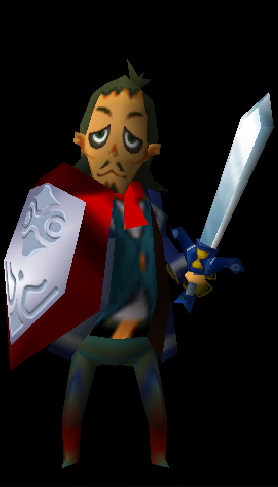](https://github.com/hylian-modding/Z64-CustomPlayerModels/raw/master/oot/pak/Linebeck.pak)
### Link from The Legend of Zelda: Majora's Mask
#### By [Skilar](https://skilarmbabcock.wixsite.com/skilarmodding)
[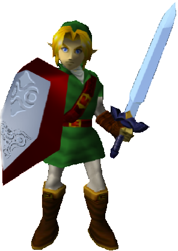](https://github.com/hylian-modding/Z64-CustomPlayerModels/raw/master/oot/pak/MMAdultLink.pak)
### Link from The Legend of Zelda: Majora's Mask
### By [Neirn](https://github.com/Neirn)
[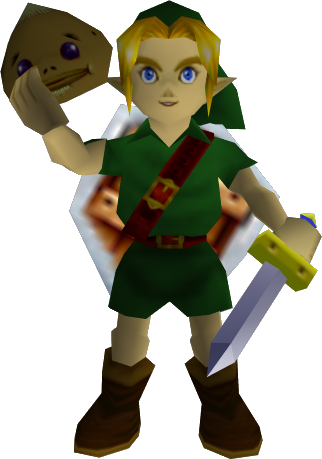](https://github.com/hylian-modding/Z64-CustomPlayerModels/raw/master/oot/pak/MM_Young_Link.pak)
### Link from The Legend of Zelda: Twilight Princess
#### By [Skilar](https://skilarmbabcock.wixsite.com/skilarmodding)
[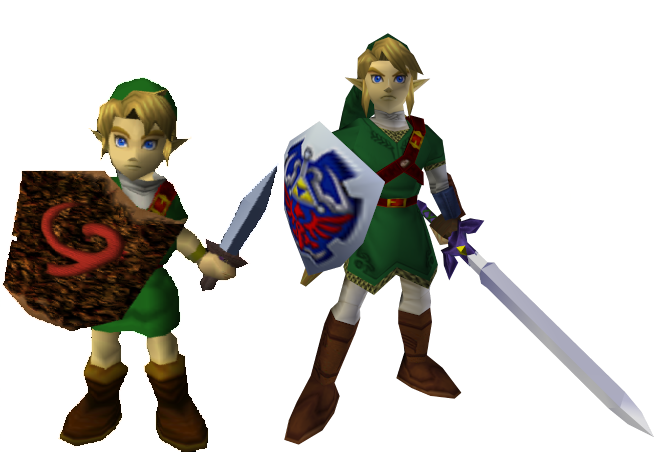](https://github.com/hylian-modding/Z64-CustomPlayerModels/raw/master/oot/pak/TPLink64.pak)
### Malon from The Legend of Zelda: Ocarina of Time
#### By [AriaHiro64](https://github.com/AriaHiro64)

### Malon from The Legend of Zelda: Ocarina of Time 3DS
#### By [Kimi-Stardust](https://github.com/Kimi-Stardust)

### Thicc Malon Original Character
#### Bt [Kimi-Stardust](https://github.com/Kimi-Stardust)
[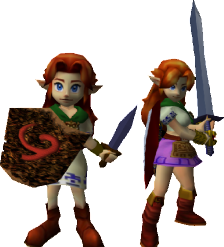](https://github.com/hylian-modding/Z64-CustomPlayerModels/raw/master/oot/pak/ThiccMalon.pak)
### Megaman Volnutt from Megaman Legends
#### By [Psi-Hate](https://github.com/Psi-Hate)
[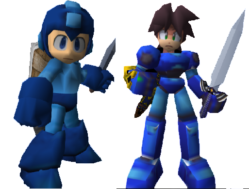](https://github.com/hylian-modding/Z64-CustomPlayerModels/raw/master/oot/pak/MegamanVolnutt.pak)
### Nia from Xenoblade
#### By [Psi-Hate](https://github.com/Psi-Hate)
[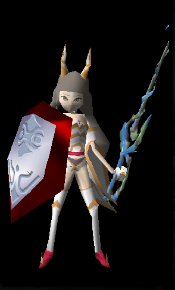](https://github.com/hylian-modding/Z64-CustomPlayerModels/raw/master/oot/pak/zzNia.pak)
### Psi-Hate Original Character
#### By [Psi-Hate](https://github.com/Psi-Hate)
[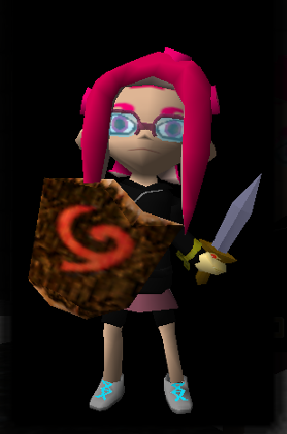](https://github.com/hylian-modding/Z64-CustomPlayerModels/raw/master/oot/pak/PsiHate.pak)
### Roll from Mega Man
#### By [Psi-Hate](https://github.com/Psi-Hate)

### Sonic from Sonic The Hedgehog
#### By [Psi-Hate](https://github.com/Psi-Hate)
[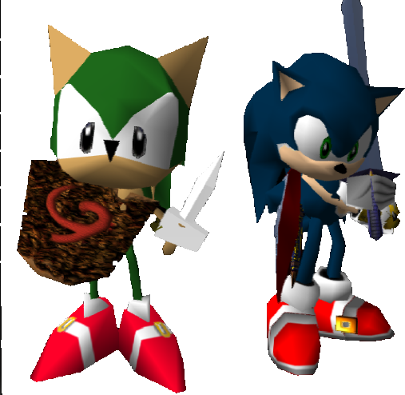](https://github.com/hylian-modding/Z64-CustomPlayerModels/raw/master/oot/pak/Sonic.pak)
### Tetra from The Legend of Zelda: The Wind Waker
#### By [Psi-Hate](https://github.com/Psi-Hate)
[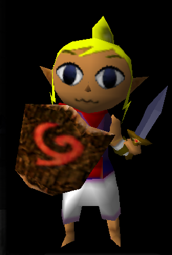](https://github.com/hylian-modding/Z64-CustomPlayerModels/raw/master/oot/pak/Tetra.pak)
### Toon Link from The Legend of Zelda: The Wind Waker
#### By [Psi-Hate](https://github.com/Psi-Hate)
[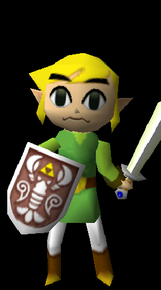](https://github.com/hylian-modding/Z64-CustomPlayerModels/raw/master/oot/pak/ToonLink.pak)
### Aria The Demon Original Character
#### By [AriaHiro64](https://github.com/AriaHiro64)
[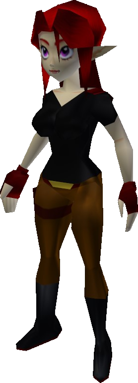](https://github.com/hylian-modding/Z64-CustomPlayerModels/raw/master/oot/pak/zzplayas_aria_the_demon.pak)

